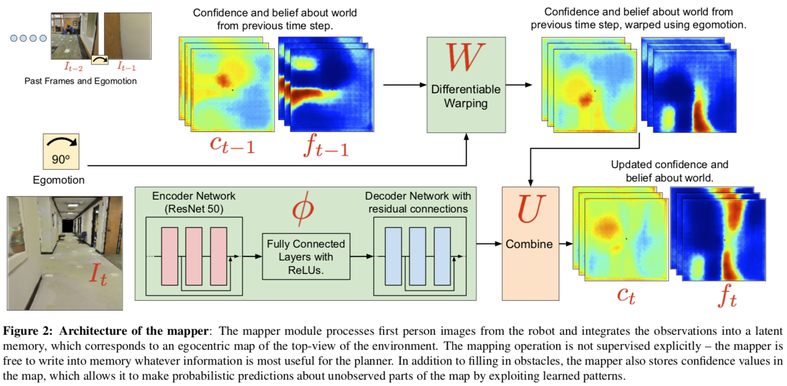
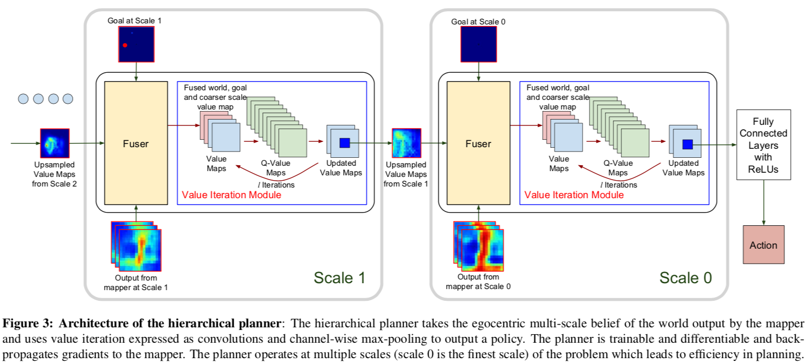

# [Cognitive Mapping and Planning for Visual Navigation](https://arxiv.org/abs/1702.03920)

##### TLDR

Authors suggest new NN methods for navigation in novel unseen environments. They use *Mapper* to transform the visual input (frames from drone cameras) into some top-down belief map of the world (latent spatial memory) and *Planner* for decision making and goals achievement. All is trained **end-to-end**.

- looks like very interesting area of research, because:
  - computer vision and environment representation problem
  - memorisation problems (why am I thinking about NLP with their memory networks?)
  - decision making, navigation and planning (and yes, it's RL)
- lot's of additional material in Appendix
- **All needed notes (don't miss the videos!) ->** [project website](https://sites.google.com/view/cognitive-mapping-and-planning/)
- [source code](https://github.com/tensorflow/models/tree/master/research/cognitive_mapping_and_planning)
- [slides](https://people.eecs.berkeley.edu/~sgupta/pdf/cmp_slides.pdf)

##### Notes

Looks like authors did all my job, cause I found their project notes quite good.

Nevertheless, I need to mention, that whole pipeline was trained with [DAGGER](https://arxiv.org/abs/1011.0686) algorithm. 

######  Architectures

So, *Mapper* builds a 2D multi-scale metric map that is used by *Planner* for end-to-end trainable planning.

######  Intetesting

- NN mapper works better than analytic one.

######  Future work

- more experiments with dynamic environments (when people are moving around?)

##### Afterword and Questions

I find quite interesting their approach to visualize the belief state of the agent. Especially, when we have the GT mask.

- This method operates over a discrete grid, but how can we adapt it for non-grid environments?
- That was the reward function? Distance to the Goal? Or it was imitation learning only?
- It's a bit unclear how do they translate *semantic task* to something with geometric meaning (looks like geometric tasks are more applicable to grid navigation problem).
- Can we use memory networks for belief state creation?
- Can we use attention mechanism or something like AlphaGo MCTS for better hierarchical planning?

##### Interesting links

1. How to transer simulation learned knowledge to real-world - [CAD2RL: Real Single-Image Flight without a Single Real Image](https://arxiv.org/abs/1611.04201)
2. DAGGER - [ A Reduction of Imitation Learning and Structured Prediction to No-Regret Online Learning](https://arxiv.org/abs/1011.0686)
2. "Bi-linear sampling allows to back-propagate gradients" - [Spatial Transformer Networks](https://arxiv.org/abs/1506.02025)
