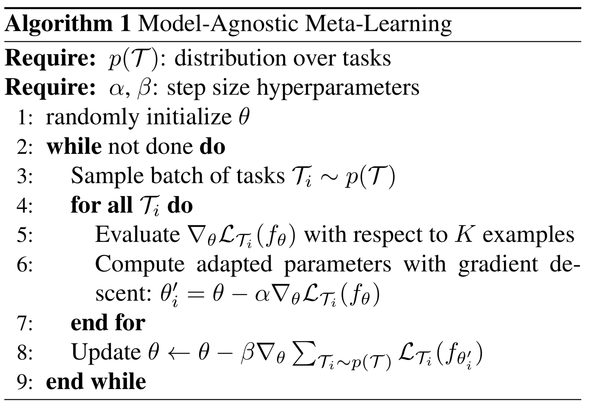
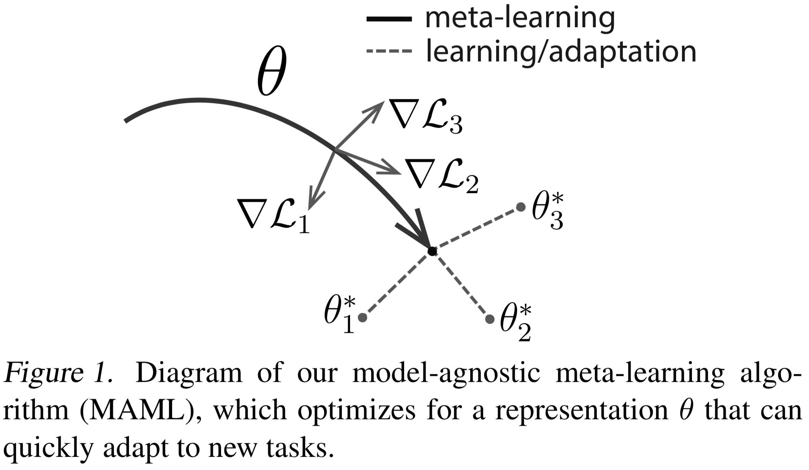
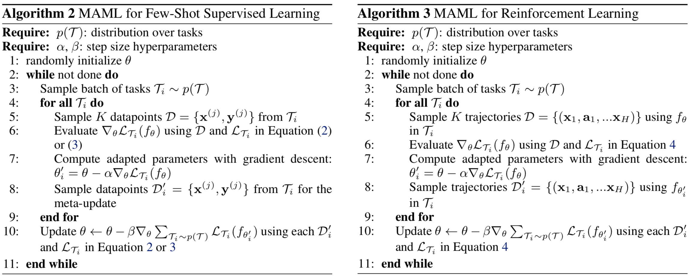
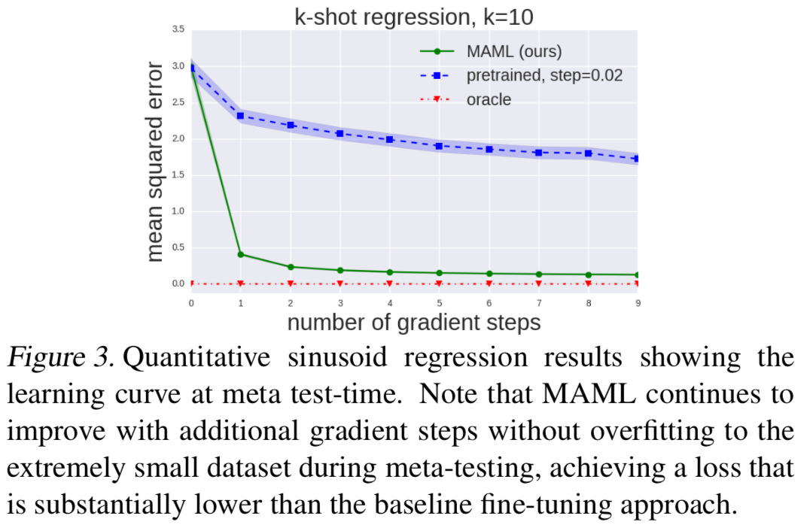
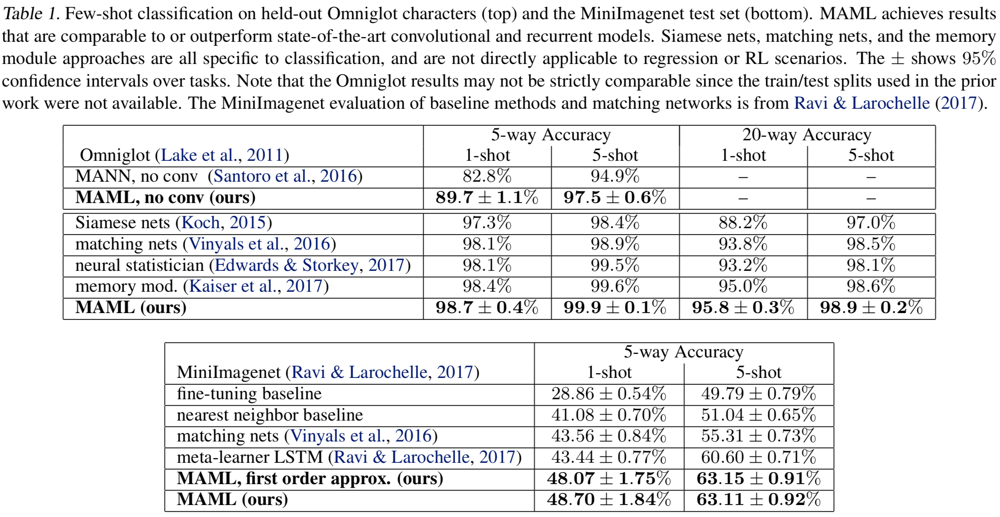

# [Model-Agnostic Meta-Learning for Fast Adaptation of Deep Networks](https://arxiv.org/abs/1703.03400)

##### TLDR

Currenly, meta-learning is very hot topic. Ability to adapt for different problems and correctly transfer learned experience from one task to another is crucial. To address this issue authors suggest a new meta-learning method, that can be used both in classification and regression and what is even more interesting - in reinforcement learning too.

- very simple and intuitive approach
- also looks very quicke one in comparison with others
- source code available

##### Notes

###### Methodology

Thanks to the authors, the paper has all necessary algorithms and figures to understant it well:

More precisely, setup for supervised or reinforcement learning (with REINFORCE algorithm):

So, here is main idea:

- take N tasks T with loss function L, you want to be good at
- for each task create sub-model thetai, that is trained and updated for that task; sample new dataset Di with (features, targets) for meta-learner
- then, we train our new model theta as an average-best from thetai's over Di's updates

Interesting stuff, in original algorithm we need to make last, meta-update, uptimizing thetai over theta throung second derivatives. Nevertheless, due to ReLU activation, we can use only by first order approximation.

###### Results & Experiments

###### Regression

###### Classification

Interesting, that first order approximation is still very accurate.

###### RL

##### Afterword

MAML looks like very simple, but powerfull approach for model meta-learning.​ Many experiments setups: untrilial regression, few-shot classification learning and velocity adaptation with RL. Lot's of interesting ideas and all is open-sourced. Just great work, you know.

##### Interesting links

1. Source code for [regression and classification](https://github.com/cbfinn/maml), [reinforcement learningg](https://github.com/cbfinn/maml_rl)
2. [Actor-Mimic: Deep Multitask and Transfer Reinforcement Learning](https://arxiv.org/abs/1511.06342)
3. [Optimization as a Model for Few-Shot Learning](https://openreview.net/forum?id=rJY0-Kcll)