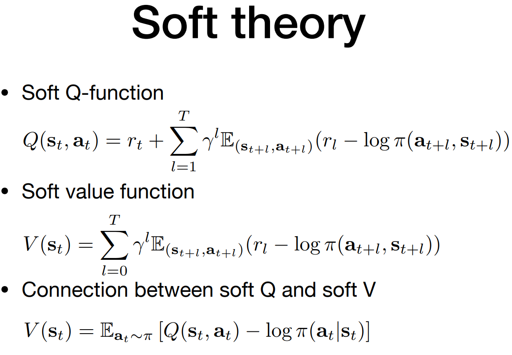
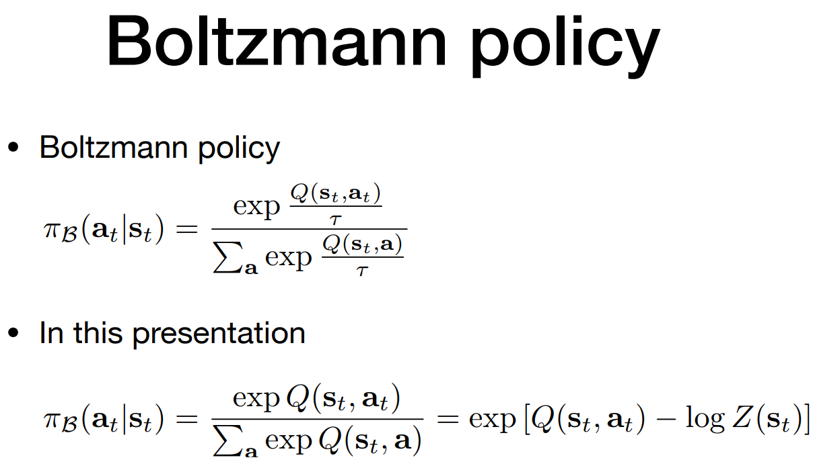
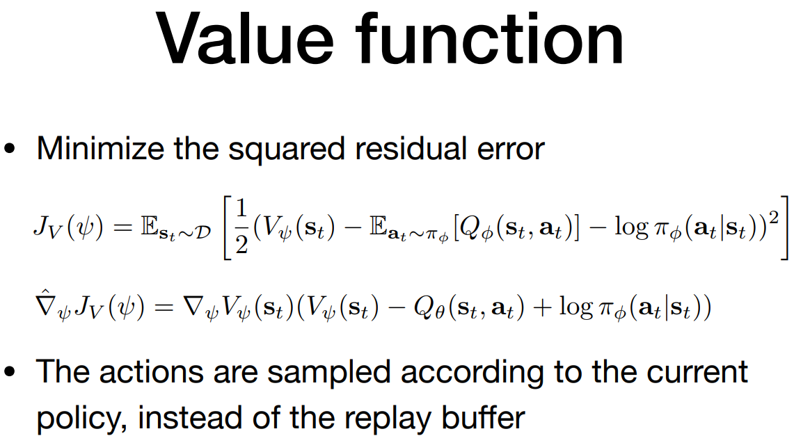
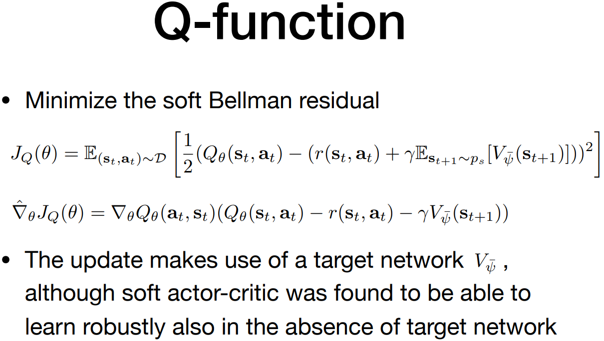
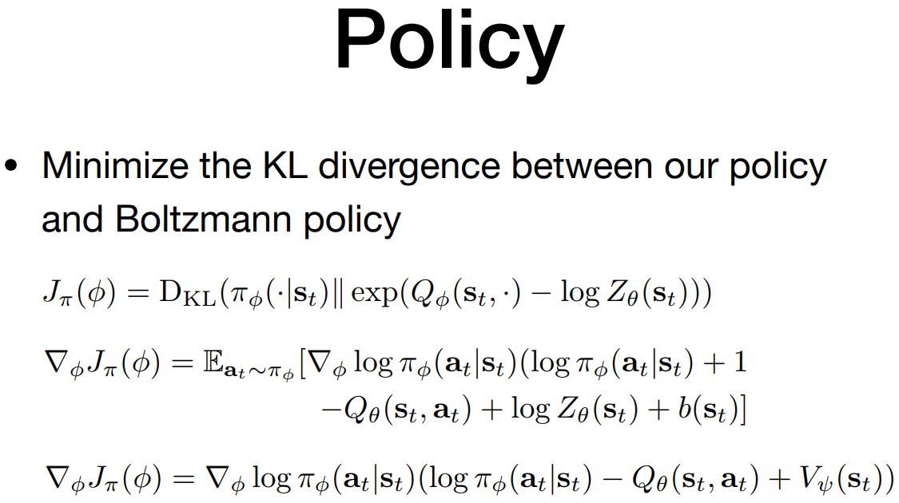
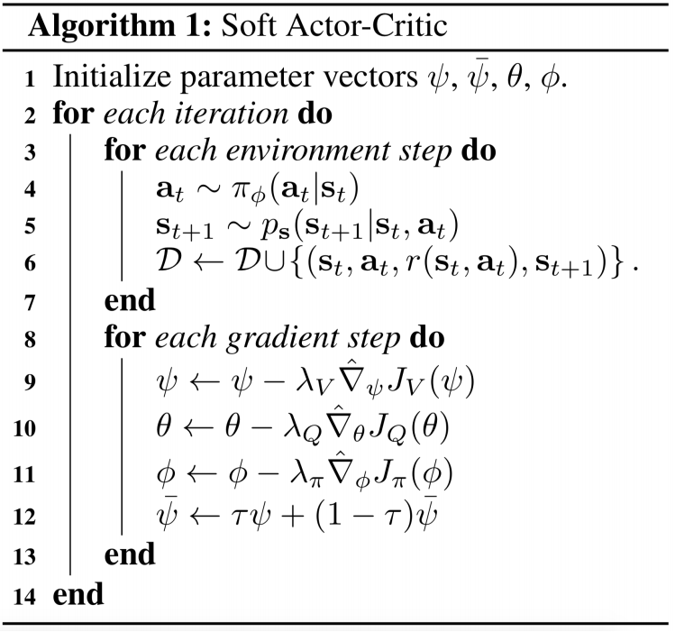
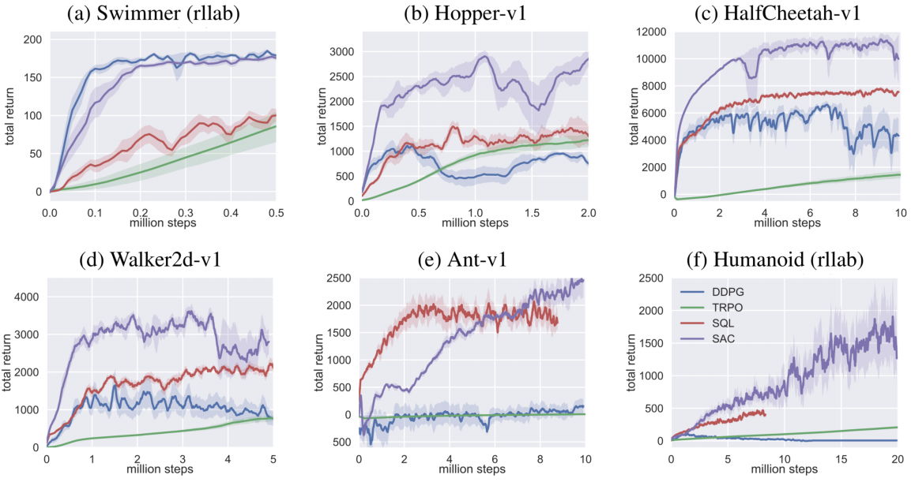
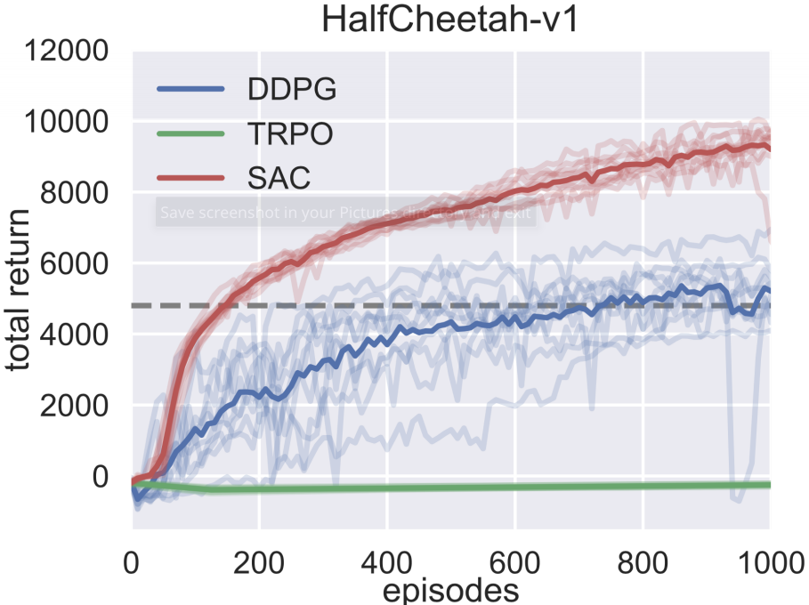
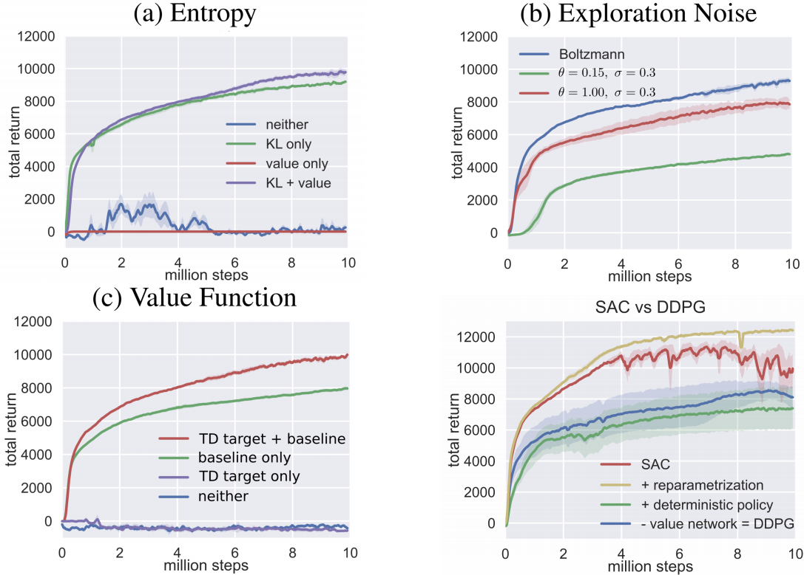
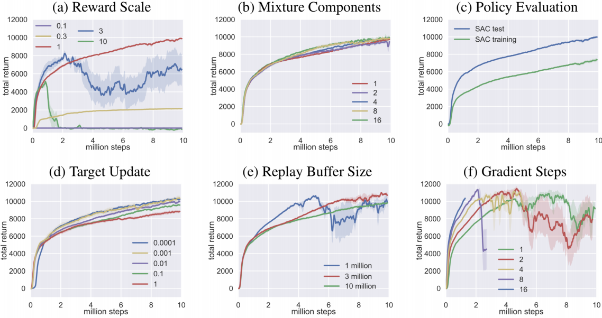

# [Soft Actor-Critic: Off-Policy Maximum Entropy Deep Reinforcement Learning with a Stochastic Actor](https://arxiv.org/abs/1801.01290)

##### TLDR

Lots of interesting stuff, but not presented well -> criticism and lots of questions.

Authors present new off-policy method. Combining off-policy update with actor-crirtic formulation they achives stable and sample-efficient algorithm for continious state-action space environments. (looks like Grail found, need to check  with implementation). Main motivation - apply RL to real-world tasks. [ Berkeley goal? ]

- quite simple idea with maximum entropy RL ( ~ just a bit tunned DDPG )
- looks like more **robust** than DDPG one
- still can't understand additional value net usage
- can be used with reparametrization trick (performance boost)
- another article with appendix (nice trend, just like it)

##### Notes

###### Theory

What we already have? Typical maximum entropy ojective (aka REINFORCE, etc):

So, let's reformulate Q-learning a bit:

additionally, policy change:

----

###### Practice

Now, let's use ~~typical~~ q-learning. How to train it all in practice?

And it's all! After that, the ~~typical~~ DDPG works:

For policy weighted Gaussian mixture were used:

---

###### Results

SAC vs SOTAs: rewards on different environments

Stability check: reward curves for different seed values

Improvements value

And hyperparameters value

##### Afterworlds

- A bit hacky theory - all about tabular setting, but in practice - DL used.
- Still have a questions about value function approximation usage? Don't see any training stabilization by plots.
- Why do authors use Gaussian mixture as a policy? It is worse then just one, by their own plot! [?!]
- Nevertheless, it looks like interesting low-cost improvement of the DDPG.

##### Interesting links

P. Henderson, R. Islam, P. Bachman, J. Pineau, D. Precup, and D. Meger. [Deep reinforcement learning that matters](https://arxiv.org/abs/1709.06560). arXiv preprint arXiv:1709.06560, 2017.

T. Haarnoja, H. Tang, P. Abbeel, and S. Levine. [Reinforcement learning with deep energy-based policies](https://arxiv.org/abs/1702.08165). arXiv preprint arXiv:1702.08165, 2017.

---

[NIPS video](https://vimeo.com/252185258)

Review by (in russian): https://www.youtube.com/watch?v=NiTJOw1aST4