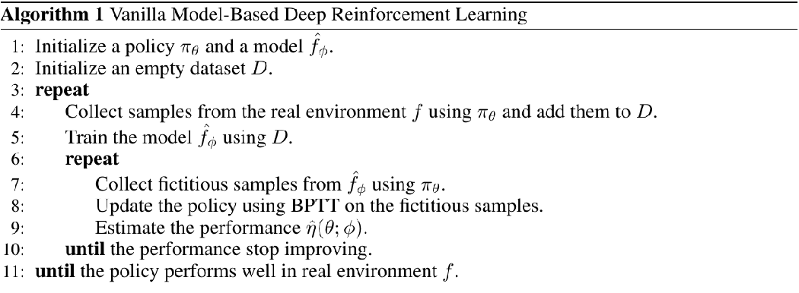
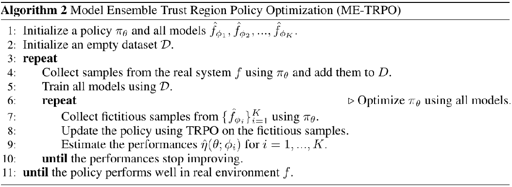
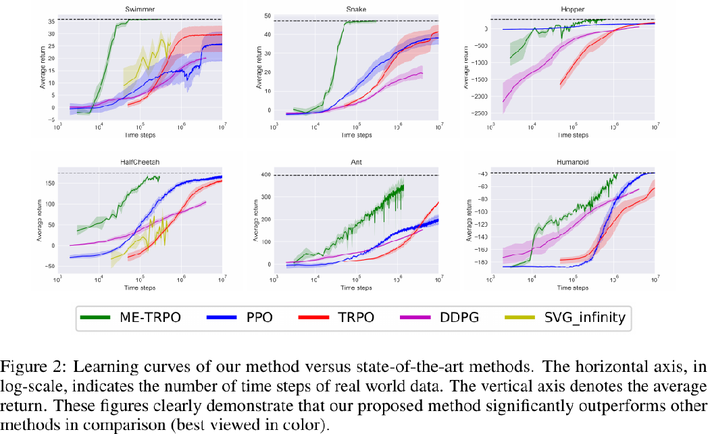
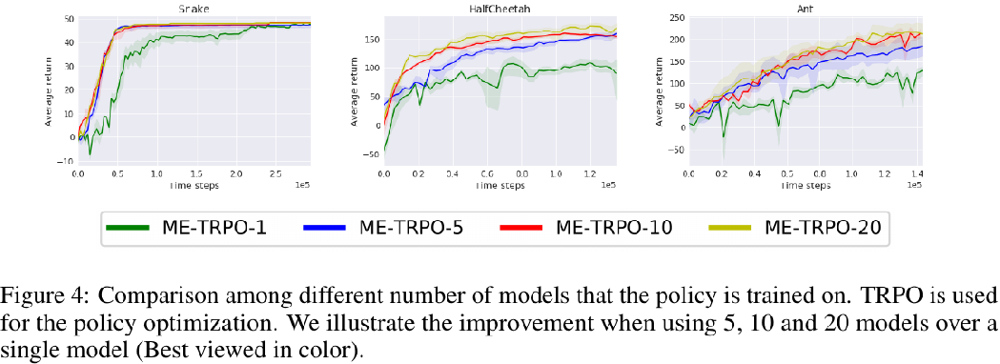
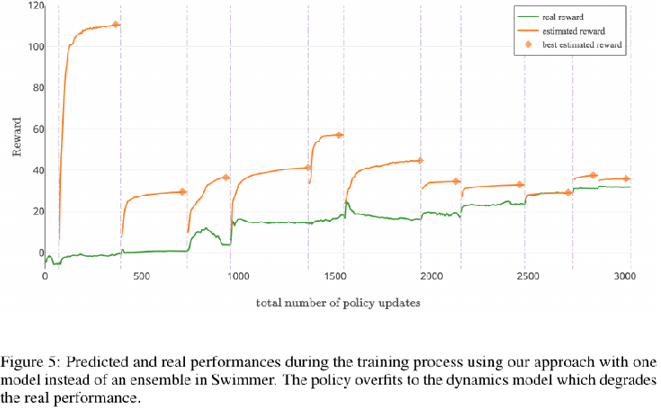

# [Model-Ensemble Trust-Region Policy Optimization](https://arxiv.org/abs/1802.10592)

##### TLDR

Model-free RL methods - easy to learn, but have very high sample complexity - can't be applied to real world problems. Model-based methods - low sample complexity, but need careful tuning for each new environment. Paper propose an approach to combine them into ME-TRPO to access easy learn with low sample complexity.

- paper with appendix
- interesting solution for real-world problems or envs with low fps

##### Notes

*Vanilla* model-based RL:

- model learning
  - collect samples form the environment
  - fit a dynamics model to the observations
- policy optimization stage
  - search for an optimal policy into learned dynamic model

Problems

- fails/overfits if there is now enough data from real environment.
- SL tricks does not works cause not i.i.d.

Proposed solution

- use ensemble of preudo-env-models (aka bootstrap over real env data?)

---

Algorithms

Tricks

- policy validation - stop policy improvement if it's better than old one in N% cases

---

Comparison with SOTAs

Effect of the number of pseudo-envs

---

Future work

- use ME-TRPO to explore difficult states where ME disagree
- apply for real-world robotics

---

Appendix

- for each env we need to specify pseudo-env reward function

Training process

*what about the policy validation trick?*

##### Afterword

Questions

- What with learning time? -> Appendix (1h for swimmer, 5d for Humanoid)
- How many samples from pseudo-envs does ME-TRPO need?
- Can we replace TRPO with REINFORCE/PPO/other-method?
- What about non-MuJoCo envs? [Yeap, NIPS: Learning to Run env]

##### Interesting links

1. Stefan Depeweg, José Miguel Hernández-Lobato, Finale Doshi-Velez, and Steffen Udluft. [Learning and policy search in stochastic dynamical systems with bayesian neural networks](https://arxiv.org/abs/1605.07127). In International Conference on Learning Representations (ICLR2017), 2017.
2. Nikhil Mishra, Pieter Abbeel, and Igor Mordatch. [Prediction and control with temporal segment models](https://arxiv.org/abs/1703.04070). arXiv preprint arXiv:1703.04070, 2017.

Review by [cydoroga](tpg.cydoroga@gmail.com) (in russian): https://youtu.be/nDsDzADmSzk